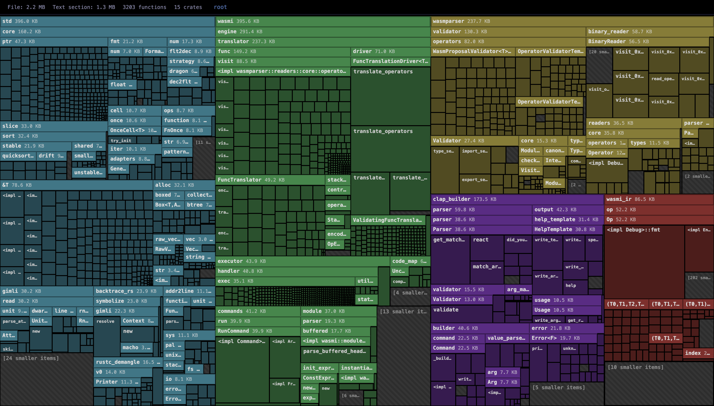

# Cargo Bloat Treemap

Interactive treemap visualizer for [cargo-bloat](https://github.com/nickel-org/cargo-bloat) JSON output. Displays binary size as a nested treemap where crates, modules, and submodules are represented as hierarchical squares — making it easy to spot the biggest contributors to binary bloat.

## Demo

[Open demo with Wasmi data](treemap.html?url=wasmi.json)



## Features

- **Nested treemap**: crates > modules > submodules > functions, sized proportionally
- **Opacity stacking**: deeper nesting levels appear brighter and more saturated
- **Click to zoom**: click any module to zoom in, Escape or breadcrumbs to zoom out
- **Hover tooltip**: shows full Rust path, size, % of text section, % of parent
- **Automatic remainder grouping**: small items grouped into `[N smaller items]` to reduce noise
- **Adjustable threshold**: slider to control remainder grouping sensitivity
- **Load from URL**: use `?url=path/to/bloat.json` to load data automatically

## Usage

Generate cargo-bloat JSON:

```sh
cargo bloat --release --message-format=json > bloat.json
```

Then open the visualizer:
- Drag & drop the JSON file onto the page
- Use the "Load JSON" button
- Use the "Paste JSON" button
- Or pass it via URL: `treemap.html?url=bloat.json`
